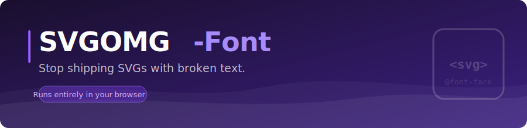

<a href="https://khawkins98.github.io/svgomg-font/">
  
</a>

# SVGOMG-Font

**[Try it live →](https://khawkins98.github.io/svgomg-font/)**

Drop in an SVG that references web fonts. Get back the same SVG with those
fonts embedded as base64 WOFF2 — so text renders reliably in any browser,
including when the file is used as an ``, emailed, or opened on a
machine without the original fonts installed.

Optional [SVGO](https://svgo.dev/) pass strips editor cruft on the way out.
Everything runs in your browser — no upload, no backend, no account.

> A companion to [SVGOMG](https://jakearchibald.github.io/svgomg/), which is
> great at optimizing SVGs but doesn't touch fonts.

## The problem

Design tools (Figma, Illustrator, Inkscape) export SVGs that reference fonts
by name — `font-family: Roboto-Bold` — without embedding them. Some emit
deprecated SVG `<font>` glyph blocks that no modern browser renders. The file
looks fine in your editor and broken everywhere else.

**SVGOMG-Font fixes both:**

1. Strips deprecated `<font>` blocks.
2. Fetches each referenced font (latin subset, WOFF2) from
   [Fontsource](https://fontsource.org/) via jsDelivr.
3. Embeds them as `@font-face` rules with `data:` URIs in the SVG's `<style>`.
4. Optionally runs SVGO with safe settings (won't shred the embedded fonts).

## Why embedding beats outlining

The common workaround is to *outline* text — converting glyphs to bezier
paths. It works visually, but:

| | Outlining | Embedding |
|---|---|---|
| **File size** | Hundreds of bytes per glyph | One WOFF2 subset (10–40 KB) covers all glyphs |
| **Accessibility** | Shapes — screen readers skip them | Real `<text>` nodes — readable by screen readers, Find-in-Page, OS a11y tools |
| **Machine-readable** | Opaque bezier curves | Searchable, translatable, LLM-readable text |
| **Editable** | Write-once | Change text by hand or programmatically |

For text-heavy SVGs, embedding a font is routinely *smaller* than outlining.

## Usage

```bash
npm install
npm run dev     # opens at http://localhost:5180
```

Or, for a one-shot start (installs deps if missing):

```bash
npm start
```

## Samples

A few test SVGs are in `public/samples/`. Pick one from the UI and click
**Process** to see the before/after. The "Roboto card" sample includes a
deprecated `<font>` block to demonstrate the strip path.

## Limitations

- Fontsource covers the Google Fonts catalog. Custom or paid fonts aren't
  resolved automatically — drop them in by hand or extend
  `src/lib/fetchFont.js` with another resolver.
- Latin subset only by default.
- Weight inference comes from the family name suffix (`-Bold`, ` Bold`, etc.).
  Ambiguous names (`Roboto`) default to weight 400.

## Stack

- [Vite](https://vitejs.dev/) — dev server + bundler
- [SVGO](https://svgo.dev/) — optional optimization pass
- Vanilla JS, no framework

## Contributing

See [CONTRIBUTING.md](CONTRIBUTING.md). Conventional Commits, small PRs.

## License

MIT — see [LICENSE](LICENSE).

